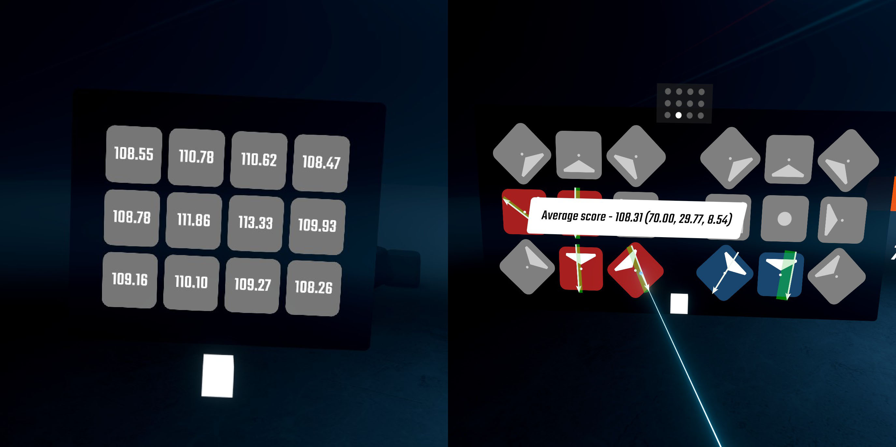

# SliceDetails

A Beat Saber mod that lets you view your average cuts per-note angle per-grid position in the pause menu and level completion screen.

## Installation

- Install `BeatSaberMarkupLanguage` and `SiraUtil` from ModAssistant or manually
- Download the [latest release](https://github.com/ckosmic/SliceDetails/releases/latest) and extract it into your Beat Saber directory

## Configuration

Configuration is handled in UserData/SliceDetails.json:
- `ShowHandle` (bool, default: false): Enables grabbable handles below the floating screens to allow you to position them
- `TrueCutOffsets` (bool, default: true): If false, magnifies higher score offsets to help give a better look at which side of the block you need to improve on.

## License
[MIT](https://choosealicense.com/licenses/mit/)